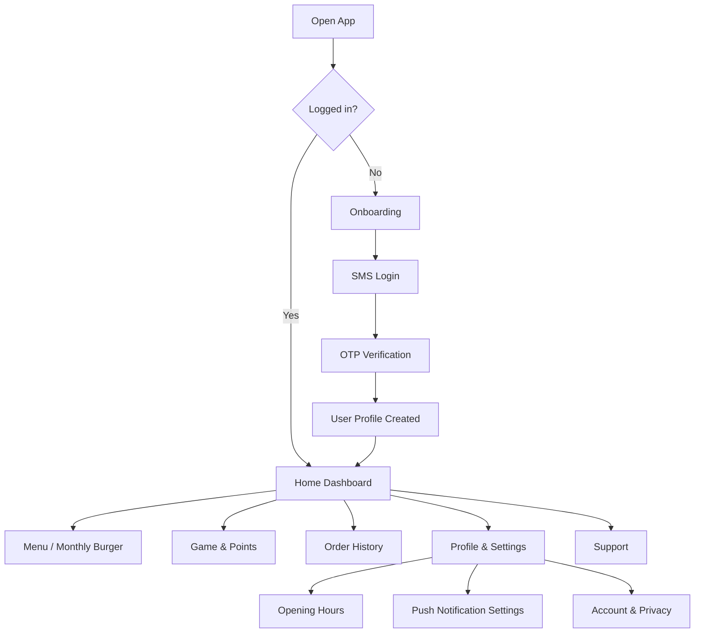
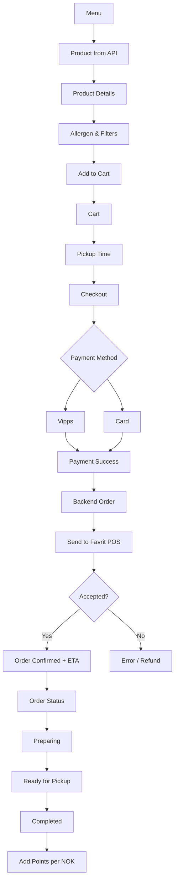
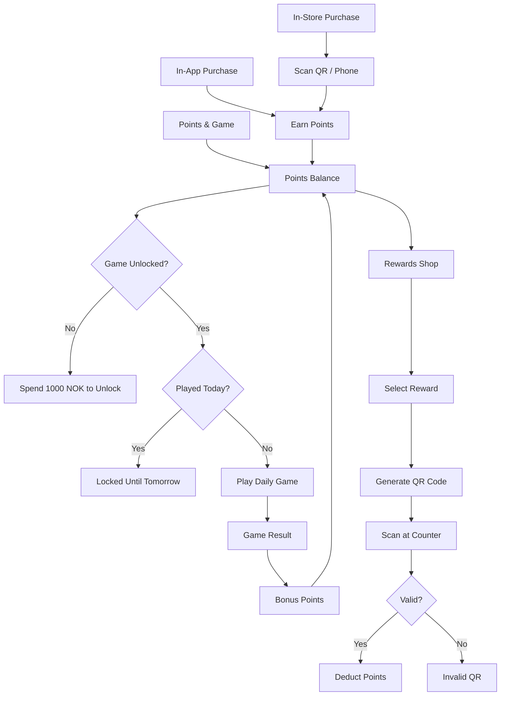
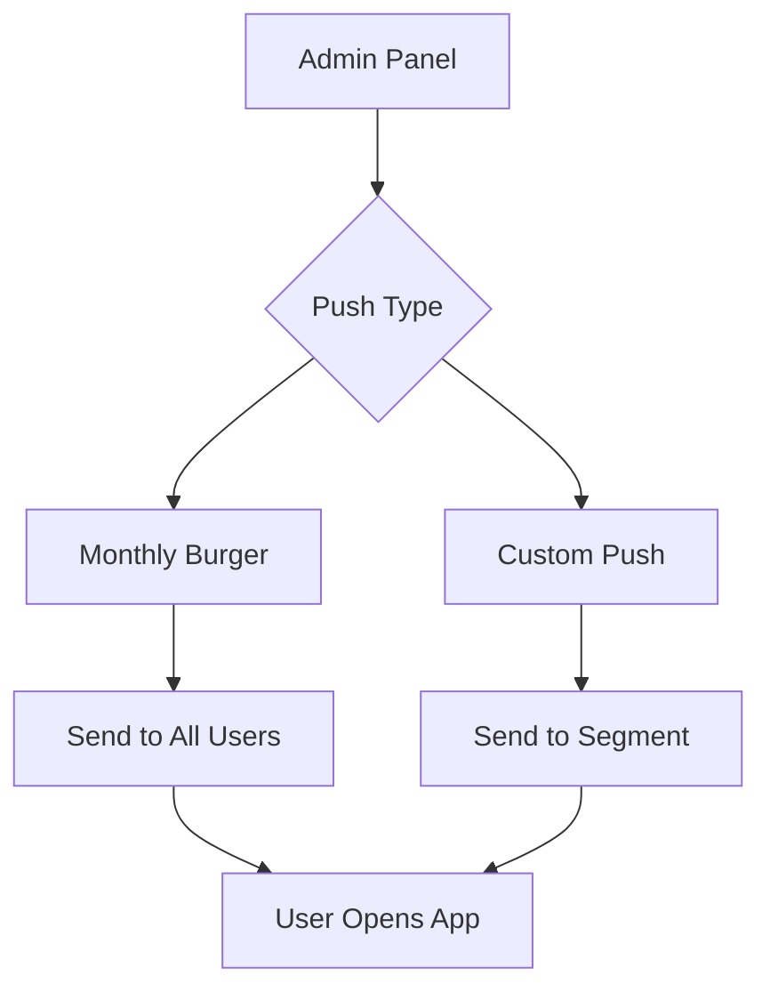

# Smæshing App – Flowchart

## 1. Main App Flow

```mermaid
flowchart TD
  A[Open App] --> B{Logged in?}
  B -- No --> C[Onboarding]
  C --> D[SMS Login]
  D --> E[OTP Verification]
  E --> F[User Profile Created]
  B -- Yes --> G[Home Dashboard]

  F --> G

  G --> H[Menu / Monthly Burger]
  G --> I[Game & Points]
  G --> J[Order History]
  G --> K[Profile & Settings]
  G --> L[Support]

  K --> K1[Opening Hours]
  K --> K2[Push Notification Settings]
  K --> K3[Account & Privacy]
```

## 2. Ordering & Pickup Flow (Favrit POS)

```mermaid
flowchart TD
  A[Menu] --> B[Product from API]
  B --> C[Product Details]
  C --> D[Allergen & Filters]
  D --> E[Add to Cart]
  E --> F[Cart]
  F --> G[Pickup Time]
  G --> H[Checkout]
  H --> I{Payment Method}
  I --> V[Vipps]
  I --> K[Card]
  V --> P[Payment Success]
  K --> P[Payment Success]

  P --> Q[Backend Order]
  Q --> R[Send to Favrit POS]
  R --> S{Accepted?}
  S -- Yes --> T[Order Confirmed + ETA]
  S -- No --> U[Error / Refund]

  T --> O[Order Status]
  O --> O1[Preparing]
  O1 --> O2[Ready for Pickup]
  O2 --> O3[Completed]

  O3 --> M[Add Points per NOK]
```

## 3. Points, Game & QR Redeem Flow

```mermaid
flowchart TD
  A[Points & Game] --> B[Points Balance]
  B --> C{Game Unlocked?}
  C -- No --> D[Spend 1000 NOK to Unlock]
  C -- Yes --> E{Played Today?}
  E -- Yes --> F[Locked Until Tomorrow]
  E -- No --> G[Play Daily Game]
  G --> H[Game Result]
  H --> I[Bonus Points]
  I --> B

  B --> J[Rewards Shop]
  J --> K[Select Reward]
  K --> L[Generate QR Code]
  L --> M[Scan at Counter]
  M --> N{Valid?}
  N -- Yes --> O[Deduct Points]
  N -- No --> P[Invalid QR]

  Q[In-App Purchase] --> R[Earn Points]
  S[In-Store Purchase] --> T[Scan QR / Phone]
  T --> R
  R --> B
```

## 4. Push Notification Flow

```mermaid
flowchart TD
  A[Admin Panel] --> B{Push Type}
  B --> C[Monthly Burger]
  B --> D[Custom Push]
  C --> E[Send to All Users]
  D --> F[Send to Segment]
  E --> G[User Opens App]
  F --> G
```
