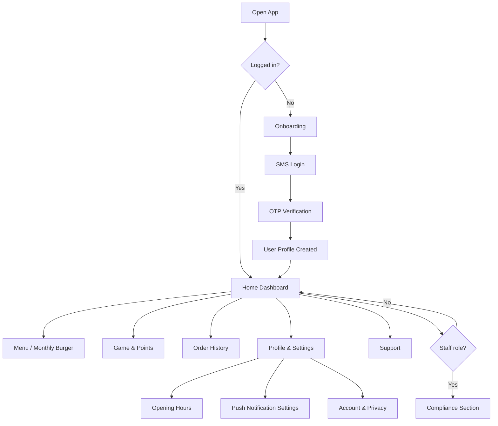
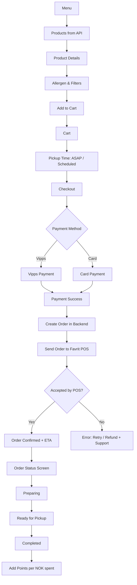
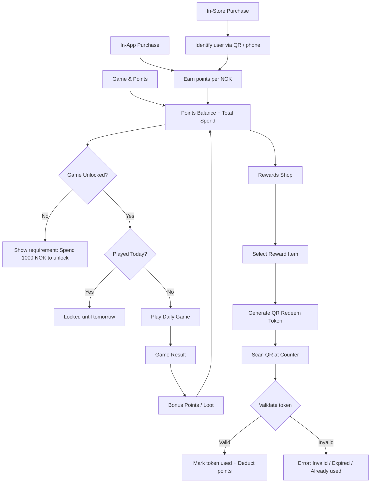
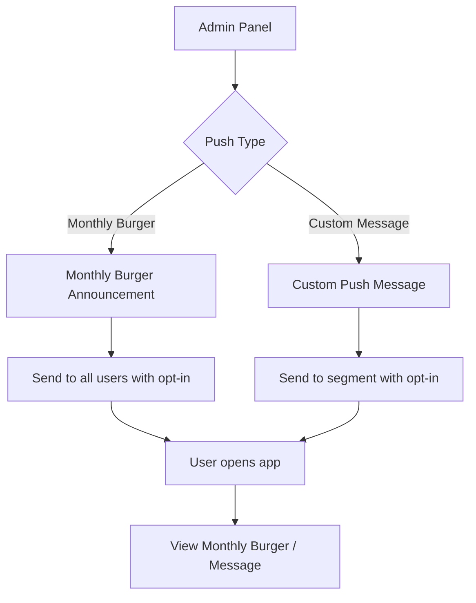
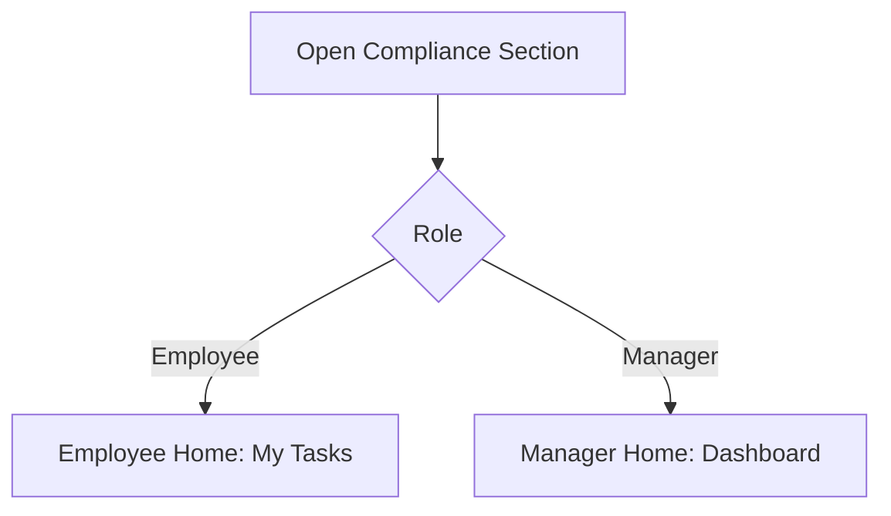
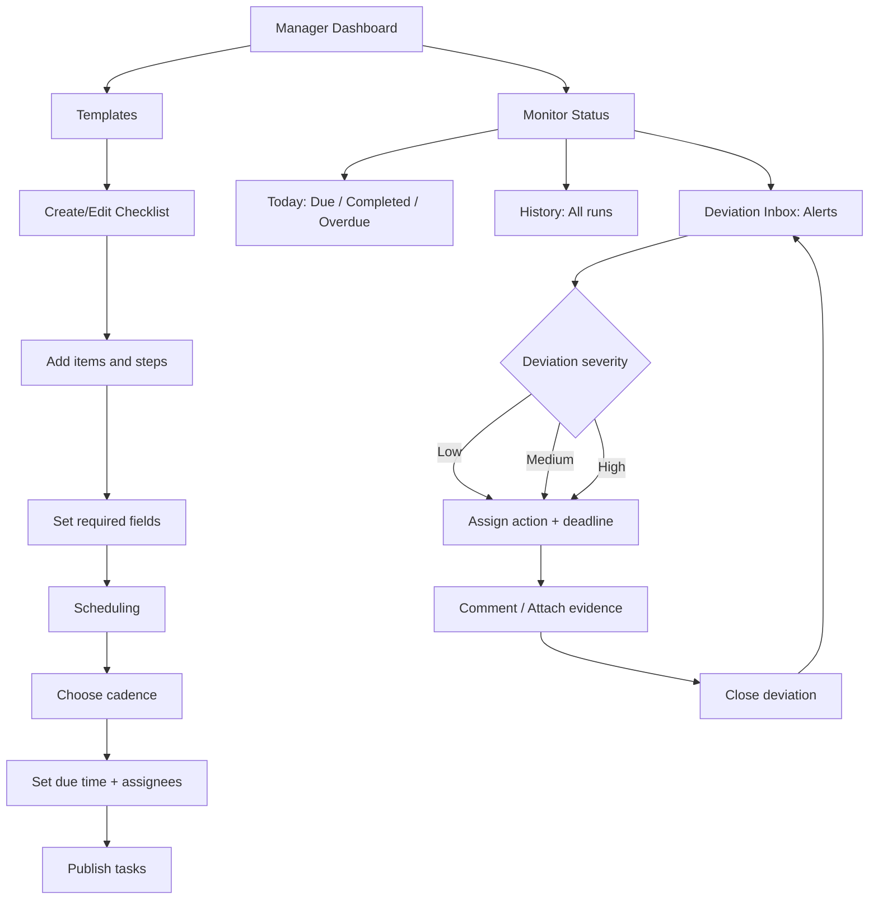
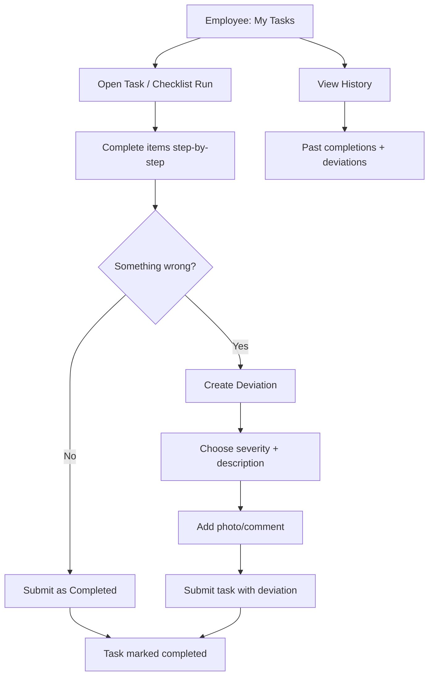
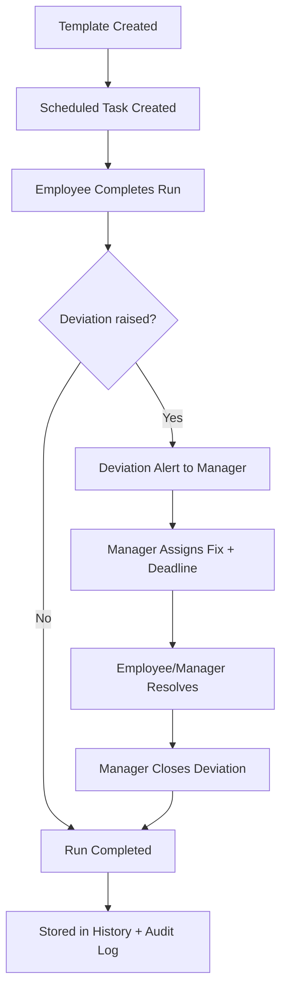

# Smæshing App - Flowchart 

This file contains Mermaid flowcharts for:
- Customer app (ordering, points, game)
- Staff-only **Compliance & Procedures** module (manager/employee)

---

## 1) Main App Flow (Customer + Staff Gate)

---

## 2) Ordering & Pickup Flow (Favrit POS)

---

## 3) Points, Game & QR Redeem Flow

---

## 4) Push Notifications (Monthly Burger + Admin Custom)

---

## 5) Compliance & Procedures (Staff-only)

### 5A) Access & Entry (Employee/Manager)

---

### 5B) Manager Flow (Create, Schedule, Assign, Monitor, Resolve)

---

### 5C) Employee Flow (Do tasks, Flag deviations, View history)

---

### 5D) End-to-end Compliance Lifecycle (Task Run → Audit Trail)

7. **Diagram 5D**: Added missing resolution step before closing deviations
8. **General**: Removed overly complex node labels, fixed syntax consistency, ensured all paths complete properly
